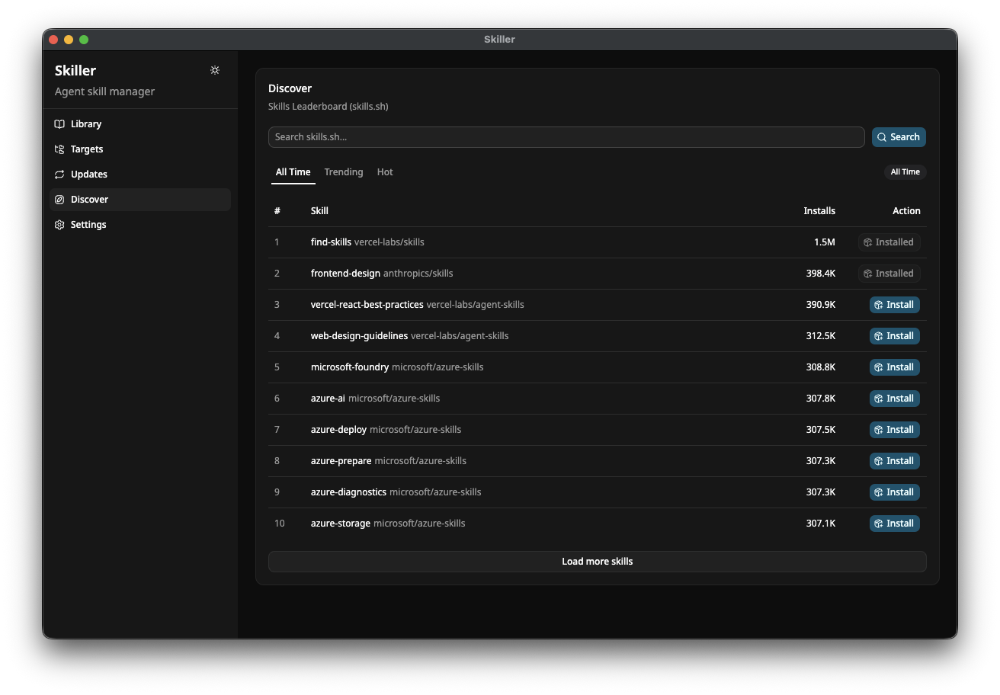

# Skiller

Skiller is a desktop app and CLI for managing local agent skills.

It keeps a master skill library, syncs enabled skills into configured agent target directories, validates skill structure, and provides discovery through the skills.sh API.



## Features

- Install skills from local folders, GitHub, and skills.sh.
- Scan a GitHub repository for valid skill directories, select and install skills you want.
- GitHub and skills.sh installs can be checked for newer upstream versions and updated.
- Packaged desktop app updates download in the background and show an Update button when ready.
- Organize library skills with sets, tags, sorting, and filtering.
- Sync enabled skills from one master library into various agent skill directories you configure.
- Validate installed skill structure and surface invalid skills in the library.

## Install

Download Skiller Desktop from the latest GitHub Release:

- macOS Apple Silicon: [`Skiller-Desktop-arm64.dmg`](https://github.com/gannonh/skiller/releases/download/desktop-v0.2.3/Skiller-Desktop-arm64.dmg)
- macOS Intel: [`Skiller-Desktop-x64.dmg`](https://github.com/gannonh/skiller/releases/download/desktop-v0.2.3/Skiller-Desktop-x64.dmg)
- Linux x64: [`Skiller-Desktop-x86_64.AppImage`](https://github.com/gannonh/skiller/releases/download/desktop-v0.2.3/Skiller-Desktop-x86_64.AppImage) or [`Skiller-Desktop-amd64.deb`](https://github.com/gannonh/skiller/releases/download/desktop-v0.2.3/Skiller-Desktop-amd64.deb)
- Linux arm64: [`Skiller-Desktop-arm64.AppImage`](https://github.com/gannonh/skiller/releases/download/desktop-v0.2.3/Skiller-Desktop-arm64.AppImage) or [`Skiller-Desktop-arm64.deb`](https://github.com/gannonh/skiller/releases/download/desktop-v0.2.3/Skiller-Desktop-arm64.deb)

The latest desktop release is `desktop-v0.2.3`.

## Usage

Use the Library view to install skills from a local folder, GitHub URL or shorthand such as `gannonh/skiller`, or the skills.sh registry. When you enter a repository URL or shorthand, Skiller scans it for installable skills and lets you select the ones you want. Organize skills with sets and tags, then sort or filter the library around those labels. Use Targets to choose agent skill directories, then sync enabled skills into those targets. Use Updates to check GitHub and skills.sh installs for newer upstream commits and apply updates. When a packaged app update finishes downloading, use the Update button beside the Skiller heading to restart into the new version.

## Workspace

This repo is a pnpm monorepo:

- `packages/core`: filesystem, manifest, validation, scanning, sync, update, and skills.sh client logic
- `packages/cli`: command-line interface backed by `packages/core`
- `apps/desktop`: Electron app with a Vite React renderer
- `packages/ui`: shared shadcn/ui workspace components

## Development

Install dependencies:

```sh
pnpm install
```

Run the desktop app:

```sh
pnpm dev
```

Run the CLI:

```sh
pnpm cli -- --help
```

Run checks:

```sh
pnpm check
```

## License

MIT
